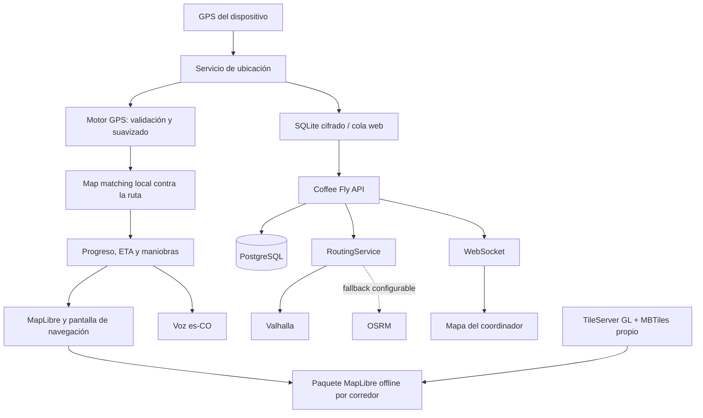

# Arquitectura de navegación

## Stack existente

- Cliente: Expo 57, React Native 0.86 y React Native Web.
- Mapas: MapLibre GL JS en web y MapLibre React Native en builds nativas.
- API: FastAPI y SQLAlchemy.
- Datos: PostgreSQL; SQLite cifrado para la cola móvil y almacenamiento web
  asociado al usuario.
- Tiempo real: WebSocket para el detalle y consulta agrupada para la flota.
- Rutas: servicio backend intercambiable entre Valhalla y OSRM.

## Flujo implementado

## Responsabilidades

- `motorNavegacionGps.js`: rechaza lecturas imposibles, suaviza posición,
  calcula rumbo, ajusta a la geometría y detecta salida persistente.
- `SeguimientoVehiculo.native.jsx`: coordina permisos, ruta, voz, recálculo,
  progreso y ciclo del viaje.
- `mapaSinConexion.native.js`: prepara y versiona corredores cartográficos del
  usuario, comprueba teselas y espacio libre, y gestiona paquetes MapLibre.
- `sinConexion.native.js`: persiste operaciones cifradas, conserva su hora de
  captura y sincroniza con reintentos e idempotencia.
- `usarPantallaActiva.js`: mantiene la pantalla encendida únicamente mientras
  la navegación del conductor está visible y libera el bloqueo al salir.
- `navegacion_services.py`: oculta Valhalla/OSRM al cliente y normaliza sus
  respuestas a un contrato común.

## Límites de diseño

El dispositivo puede continuar sobre la ruta ya calculada sin red. El cálculo
de una ruta vial nueva y el map matching remoto necesitan el backend. El motor
local no inventa caminos ausentes de los datos cartográficos.
