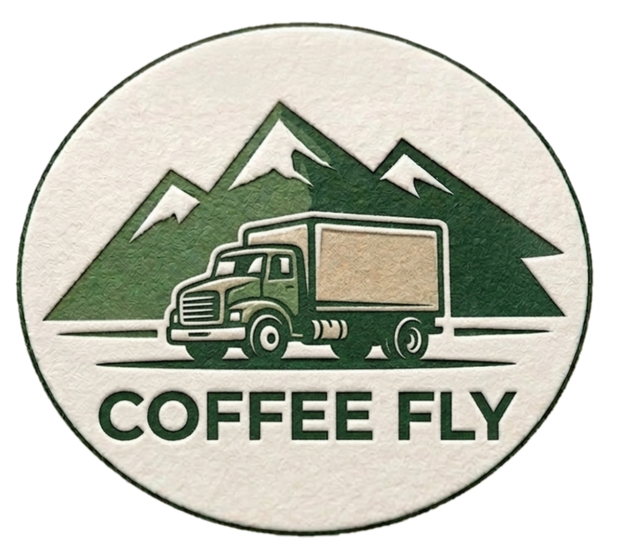

# ☕ Cumbre Cafetera — Aplicativo de Transporte y Logística de Café

**SENA · Tecnólogo en Análisis y Desarrollo de Software · Ficha 3407179**
**Bootcamp: Arquitectura de Software · Marzo 2026**

---

## 1️⃣ ¿Qué Problema Resuelve?

La empresa **Cumbre Cafetera** coordina la recolección y transporte de café desde caficultores rurales hacia centros de acopio, operando en zonas con conectividad limitada o intermitente. Actualmente, todo el proceso se gestiona de forma manual con papel y registros escritos a mano, lo que genera:

- Errores e inconsistencias en los datos registrados
- Pérdida de información y baja trazabilidad del café
- Dificultades para coordinar vehículos y conductores en tiempo real
- Retrasos en las entregas y desorganización en la recepción del producto

Este sistema es una **plataforma de gestión logística integral** que digitaliza el flujo del café desde las zonas de producción hasta los centros de acopio. Permite gestionar caficultores, solicitudes de recolección, entregas y vehículos, hacer seguimiento del estado de cada carga mediante GPS en tiempo real, y generar reportes operativos, **incluso sin conexión a internet**.

---

## 2️⃣ Usuarios del Sistema

| Rol | Responsabilidades |
|---|---|
| **Coordinador** | Revisa solicitudes de recolección, registra entregas vinculadas al caficultor, asigna vehículos y conductores, consulta historial, genera y exporta reportes, y hace seguimiento GPS de los vehículos. |
| **Conductor** | Consulta las entregas asignadas a su vehículo, actualiza el estado de la carga (Pendiente → En camino → Entregado) y visualiza su ruta y destino en el GPS. |
| **Registrador** | Crea, edita y elimina cuentas de todos los roles del sistema. Registra, edita y elimina vehículos. |
| **Caficultor** | Envía solicitudes de recolección cuando tiene café listo para recoger. Consulta el estado e historial de sus entregas y hace seguimiento GPS del vehículo asignado. |

---

## 3️⃣ Flujo de Operación

```
Caficultor → envía solicitud de recolección
     ↓
Coordinador → registra la entrega y asigna vehículo + conductor
     ↓
Conductor → realiza el viaje y actualiza el estado en tiempo real
     ↓
Caficultor / Coordinador → hacen seguimiento GPS del vehículo
     ↓
Conductor → marca la entrega como "Entregado"
```

---

## 4️⃣ Funcionalidades Principales

### Requisitos Funcionales

| ID | Nombre | Rol | Prioridad |
|---|---|---|---|
| RF-01 | Registro de usuarios | Registrador | Alta |
| RF-02 | Autenticación de usuarios | Todos | Alta |
| RF-03 | Solicitud de recolección de café | Caficultor | Alta |
| RF-04 | Registro de entrega de café | Coordinador | Alta |
| RF-05 | Actualización de estado de entrega | Conductor | Alta |
| RF-06 | Consulta de historial de entregas | Coordinador / Caficultor | Media |
| RF-07 | Registro de vehículos | Registrador | Alta |
| RF-08 | Asignación de vehículo a entrega | Coordinador | Alta |
| RF-09 | Consulta de estado de vehículos | Coordinador | Media |
| RF-10 | Seguimiento GPS del vehículo | Coordinador / Conductor / Caficultor | Alta |
| RF-11 | Funcionamiento en modo offline | Conductor / Coordinador | Alta |
| RF-12 | Sincronización automática de datos | Todos | Alta |
| RF-13 | Generación de reportes | Coordinador | Media |
| RF-14 | Exportación de reportes | Coordinador | Baja |
| RF-15 | Dashboard / Panel de inicio | Todos | Media |

### Requisitos No Funcionales

| ID | Nombre | Descripción | Prioridad |
|---|---|---|---|
| RNF-01 | Usabilidad | Registro completo en menos de 3 minutos sin capacitación previa | Alta |
| RNF-02 | Disponibilidad offline | Operación continua por al menos 8 horas sin conexión; datos seguros hasta 72 horas | Alta |
| RNF-03 | Rendimiento | Respuesta en menos de 3 segundos para el 95% de las operaciones con hasta 10 usuarios concurrentes | Alta |
| RNF-04 | Seguridad | HTTPS/TLS, tokens JWT, contraseñas con bcrypt, datos offline cifrados con AES-256 | Alta |
| RNF-05 | Escalabilidad | Soporta hasta 500 caficultores, 10.000 entregas históricas y 20 usuarios concurrentes | Media |
| RNF-06 | Compatibilidad | Android 8.0+, iOS 13+, Chrome / Firefox / Edge; diseño responsivo desde 5" | Alta |
| RNF-07 | Confiabilidad de datos | Guardado automático e inmediato; recuperación ante cierres inesperados | Alta |

---

## 5️⃣ Alcance

El sistema cubre el **registro, control y seguimiento logístico** de las jornadas de acopio de café.

**Incluido:**
- Gestión de caficultores, solicitudes, entregas, vehículos y usuarios
- Seguimiento de estados con trazabilidad completa
- Seguimiento GPS en tiempo real con WebSockets
- Modo offline con sincronización automática (SQLite)
- Generación y exportación de reportes básicos

**Excluido:**
- Gestión de pagos o facturación electrónica
- Integración con plataformas externas
- Módulos ajenos a la operación interna de acopio

---

## 6️⃣ Arquitectura y Tecnología

### Metodología: Scrum

Se eligió Scrum por su enfoque iterativo e incremental, que permite desarrollar el sistema en Sprints con entregas funcionales. El entorno logístico de Cumbre Cafetera es dinámico: rutas cambian, la disponibilidad de conductores varía y los requerimientos evolucionan. Scrum facilita la adaptación a esos cambios, reduce riesgos al detectar errores desde etapas iniciales y mejora la comunicación entre el equipo y la empresa.

**Roles:** Product Owner · Scrum Master · Equipo de Desarrollo
**Artefactos:** Product Backlog · Sprint Backlog · Daily Scrum · Sprint Review & Retrospective

### Arquitectura: N-Capas

La arquitectura en capas separa el sistema en responsabilidades bien definidas, lo que permite que el equipo trabaje en paralelo sin interferencias, facilita el mantenimiento futuro y escala la solución sin reescribir desde cero.

| Capa | Responsabilidad |
|---|---|
| **Models** | Definen las entidades del sistema: Usuario, Caficultor, Vehículo, Solicitud, Entrega, GPS, Historial |
| **Schemas** | Validan los datos de entrada y salida (ej: coordenadas GPS válidas, solicitudes completas) |
| **Repositories** | Comunicación directa con PostgreSQL: guardar ubicaciones, consultar viajes, registrar eventos |
| **Services** | Contienen las reglas de negocio: iniciar viaje, validar solicitudes, procesar sincronización offline |
| **API / Routers** | Puntos de acceso que reciben peticiones de la app móvil y el sistema web y las dirigen al servicio correspondiente |

### Estrategia Offline First

El transporte de café se realiza en zonas rurales con cobertura limitada. Por eso el sistema implementa una estrategia **Offline First**:

1. **Almacenamiento local (SQLite):** los datos se guardan en el dispositivo si no hay conexión
2. **Cola de pendientes:** los registros se marcan para sincronización posterior
3. **Sincronización automática:** al detectar conexión, el sistema envía los datos en segundo plano sin interrumpir al usuario

### GPS y Trazabilidad en Tiempo Real

- La app captura periódicamente **latitud, longitud, fecha/hora y estado del viaje**
- Se usan **WebSockets** para transmitir la ubicación automáticamente sin consultas constantes
- **PostgreSQL + PostGIS** permite almacenar coordenadas, calcular distancias, analizar rutas, implementar geocercas y generar reportes geográficos

### Stack Tecnológico

| Capa | Tecnología | Justificación |
|---|---|---|
| **Backend** | Python + FastAPI | Alto rendimiento, manejo de múltiples solicitudes simultáneas, ideal para APIs REST y WebSockets |
| **Base de datos** | PostgreSQL + PostGIS | Robusta, gratuita, soporta información geográfica para GPS y rutas |
| **Frontend web** | React | Interfaces responsivas, amplia documentación, experiencia previa del equipo |
| **App móvil** | React Native | Una sola base de código para Android e iOS |
| **Offline** | SQLite | Almacenamiento local ligero y confiable en dispositivos móviles |

---

## 7️⃣ Equipo

| Nombre | Rol |
|---|---|
| Brandon Cristopher Poveda Romero | Líder |
| Cristian Ronaldo Hernández Ducuara | Arquitecto · Asegurador de Calidad |
| Jhonatan David Prieto González | Programador |
| Nicolás Ramírez Rincón | Analista |

**Instructora:** Rocío Malpica
